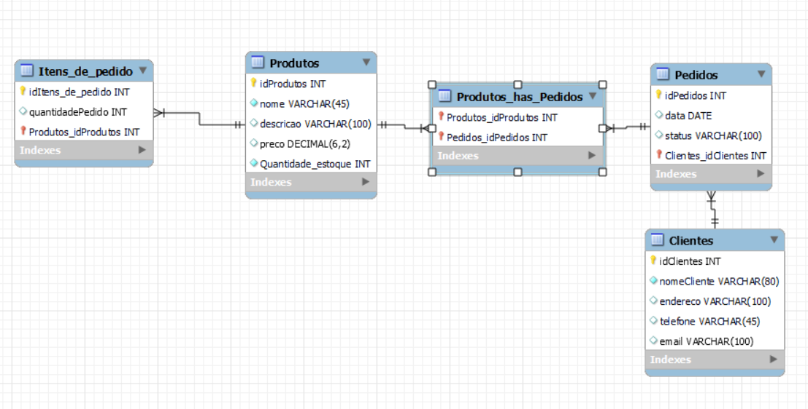

# Comercio_Eletronico

Você foi designado para criar um sistema de comercio eletrônico. Aqui estão os detalhes adicionais:

### Tabelas:

Produtos: Armazene informações sobre produtos, como nome, descrição, preço e quantidade em estoque.

Pedidos: Registre detalhes de pedidos, incluindo data, cliente e status.

Clientes: Mantenha informações dos clientes, como nome, endereço de entrega e informações de contato.

Itens de Pedido: Registre os produtos incluídos em cada pedido, junto com a quantidade.

### Relacionamentos:

Crie um relacionamento entre "Pedidos" e "Clientes" para rastrear os pedidos de cada cliente.

Estabeleça um relacionamento entre "Itens de Pedido" e "Produtos" para associar produtos a pedidos.

diagrama lógico:

### Stored Procedures:

Implemente uma stored procedure para permitir que os clientes adicionem produtos ao carrinho de compras.

Crie uma stored procedure para processar pedidos, atualizando o estoque de produtos e registrando os detalhes do pedido.

Desenvolva uma stored procedure para calcular o total de um pedido com base nos produtos incluídos.

### Views:

Crie uma view que mostre o histórico de pedidos de um cliente específico, incluindo os produtos incluídos em cada pedido.

Implemente uma view que forneça uma lista de todos os produtos disponíveis, excluindo aqueles que estão esgotados.
