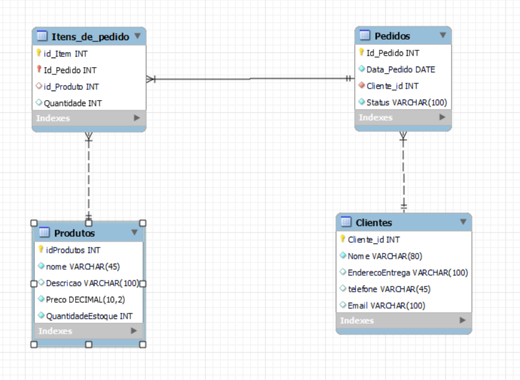
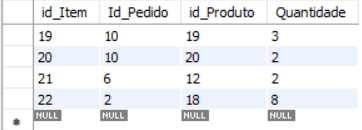
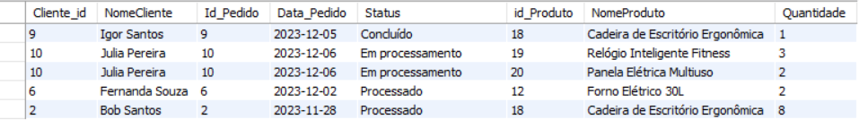
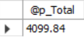
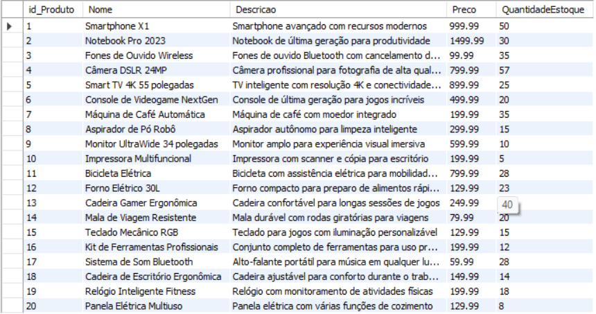

<h1 align="center">Comércio Eletrônico — Modelagem e Automação com MySQL</h1>

## O Problema

Imagine uma loja online com dezenas de produtos, centenas de clientes e pedidos chegando todos os dias. Sem uma estrutura de dados bem definida, o caos é inevitável: estoques desatualizados, pedidos sem rastreamento, histórico de compras inacessível e cálculos de total feitos na mão.

O desafio era construir um banco de dados relacional que resolvesse tudo isso de forma automatizada — do carrinho de compras até o processamento do pedido e o controle de estoque.

---

## A Solução

Modelei um banco de dados MySQL com quatro tabelas relacionadas entre si, três stored procedures para automatizar as operações críticas e duas views para facilitar consultas recorrentes.

### Modelagem Relacional

O primeiro passo foi definir as entidades e seus relacionamentos:



**Clientes** — quem compra
```sql
CREATE TABLE Clientes (
    Cliente_id INT NOT NULL AUTO_INCREMENT,
    Nome VARCHAR(200) NOT NULL,
    EnderecoEntrega VARCHAR(255),
    Telefone VARCHAR(20) NOT NULL,
    Email VARCHAR(200) NOT NULL,
    PRIMARY KEY (Cliente_id)
);
```

**Produtos** — o que está à venda e quanto há em estoque
```sql
CREATE TABLE Produtos (
    id_Produto INT NOT NULL AUTO_INCREMENT,
    Nome VARCHAR(200) NOT NULL,
    Descricao TEXT,
    Preco DECIMAL(10, 2) NOT NULL,
    QuantidadeEstoque INT NOT NULL,
    PRIMARY KEY (id_Produto)
);
```

**Pedidos** — o vínculo entre cliente e compra, com rastreamento de status
```sql
CREATE TABLE Pedidos (
    Id_Pedido INT NOT NULL AUTO_INCREMENT,
    Data_Pedido DATE NOT NULL,
    Cliente_id INT NOT NULL,
    Status VARCHAR(200) NOT NULL,
    PRIMARY KEY (Id_Pedido),
    FOREIGN KEY (Cliente_id) REFERENCES Clientes(Cliente_id)
);
```

**Itens\_Pedido** — quais produtos fazem parte de cada pedido e em qual quantidade
```sql
CREATE TABLE Itens_Pedido (
    id_Item INT NOT NULL AUTO_INCREMENT,
    Id_Pedido INT NOT NULL,
    id_Produto INT NOT NULL,
    Quantidade INT NOT NULL,
    PRIMARY KEY (id_Item),
    FOREIGN KEY (Id_Pedido) REFERENCES Pedidos(Id_Pedido),
    FOREIGN KEY (id_Produto) REFERENCES Produtos(id_Produto)
);
```

---

## Automatizando as Operações com Stored Procedures

Operações repetitivas e críticas — como atualizar estoque ou calcular totais — não devem depender de lógica manual. Resolvi isso com três procedures.

### 1. Adicionar ao Carrinho

Permite que um cliente adicione um produto ao pedido ativo sem precisar de múltiplos INSERTs manuais:

```sql
DELIMITER $
CREATE PROCEDURE AdicionarAoCarrinho(
    IN p_ClienteId INT,
    IN p_ProdutoId INT,
    IN p_Quantidade INT
)
BEGIN
    INSERT INTO Itens_Pedido (Id_Pedido, id_Produto, Quantidade)
    VALUES (
        (SELECT MAX(Id_Pedido) + 1 FROM Pedidos WHERE Cliente_id = p_ClienteId),
        p_ProdutoId,
        p_Quantidade
    );
END $
DELIMITER ;
```

```sql
CALL AdicionarAoCarrinho(5, 12, 2);
```



---

### 2. Processar Pedido

Com uma única chamada, o estoque é deduzido automaticamente e o status do pedido é atualizado — eliminando o risco de inconsistência entre essas duas operações:

```sql
DELIMITER $
CREATE PROCEDURE ProcessarPedido(
    IN p_PedidoId INT
)
BEGIN
    UPDATE Produtos P
    JOIN Itens_Pedido IP ON P.id_Produto = IP.id_Produto
    SET P.QuantidadeEstoque = P.QuantidadeEstoque - IP.Quantidade
    WHERE IP.Id_Pedido = p_PedidoId;

    UPDATE Pedidos
    SET Status = 'Processado'
    WHERE Id_Pedido = p_PedidoId;
END $
DELIMITER ;
```

```sql
CALL ProcessarPedido(6);
SELECT * FROM HistoricoPedidosCliente;
```



---

### 3. Calcular Total do Pedido

Retorna o valor total de um pedido somando preço × quantidade de cada item:

```sql
DELIMITER $
CREATE PROCEDURE CalcularTotalPedido(
    IN p_PedidoId INT,
    OUT p_Total DECIMAL(10, 2)
)
BEGIN
    SELECT SUM(P.Preco * IP.Quantidade) INTO p_Total
    FROM Produtos P
    JOIN Itens_Pedido IP ON P.id_Produto = IP.id_Produto
    WHERE IP.Id_Pedido = p_PedidoId;
END $
DELIMITER ;
```

```sql
SET @p_Total = 0;
CALL CalcularTotalPedido(2, @p_Total);
SELECT @p_Total;
```



---

## Simplificando Consultas com Views

Duas views foram criadas para encapsular consultas que seriam feitas com frequência.

**Histórico completo de pedidos por cliente** — junta clientes, pedidos, itens e produtos em uma única consulta:

```sql
CREATE VIEW HistoricoPedidosCliente AS
SELECT
    C.Cliente_id,
    C.Nome AS NomeCliente,
    P.Id_Pedido,
    P.Data_Pedido,
    P.Status,
    IP.id_Produto,
    Pr.Nome AS NomeProduto,
    IP.Quantidade
FROM Clientes C
JOIN Pedidos P ON C.Cliente_id = P.Cliente_id
JOIN Itens_Pedido IP ON P.Id_Pedido = IP.Id_Pedido
JOIN Produtos Pr ON IP.id_Produto = Pr.id_Produto;
```

**Produtos disponíveis** — exibe apenas itens com estoque maior que zero:

```sql
CREATE VIEW ProdutosDisponiveis AS
SELECT *
FROM Produtos
WHERE QuantidadeEstoque > 0;
```

```sql
SELECT * FROM ProdutosDisponiveis;
```



---

## Tecnologias

- MySQL 8.x
- Stored Procedures
- Views
- Chaves estrangeiras e integridade referencial

## Código-fonte

[Comercio_eletronico.sql](Comercio_eletronico.sql)
