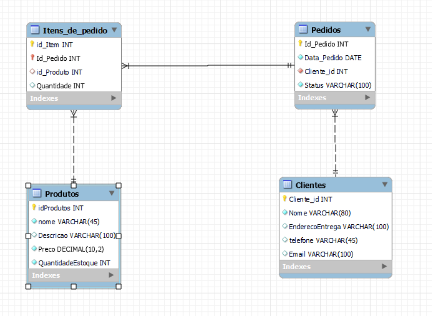

<h1 align="center">Comércio eletrônico</h1>

Você foi designado para criar um sistema de comercio eletrônico. Aqui estão os detalhes adicionais:

### Tabelas:

Produtos: Armazene informações sobre produtos, como nome, descrição, preço e quantidade em estoque.

```mysql
CREATE TABLE Produtos (
    id_Produto INT NOT NULL AUTO_INCREMENT,
    Nome VARCHAR(200) NOT NULL,
    Descricao TEXT,
    Preco DECIMAL(10, 2) NOT NULL,
    QuantidadeEstoque INT NOT NULL,
    PRIMARY KEY (id_Produto)
);
```

Pedidos: Registre detalhes de pedidos, incluindo data, cliente e status.

```mysql
CREATE TABLE Pedidos (
    Id_Pedido INT NOT NULL AUTO_INCREMENT,
    Data_Pedido DATE NOT NULL,
    Cliente_id INT NOT NULL,
    Status VARCHAR(200) NOT NULL,
    PRIMARY KEY (Id_Pedido),
    FOREIGN KEY (Cliente_id) REFERENCES Clientes(Cliente_id)
);
```
Clientes: Mantenha informações dos clientes, como nome, endereço de entrega e informações de contato.

```mysql
CREATE TABLE Clientes (
    Cliente_id INT NOT NULL AUTO_INCREMENT,
    Nome VARCHAR(200) NOT NULL,
    EnderecoEntrega VARCHAR(255),
    Telefone VARCHAR(20) NOT NULL,
    Email VARCHAR(200) NOT NULL,
    PRIMARY KEY (Cliente_id)
);
```
Itens de Pedido: Registre os produtos incluídos em cada pedido, junto com a quantidade.

```mysql
CREATE TABLE Itens_Pedido (
    id_Item INT NOT NULL AUTO_INCREMENT,
    Id_Pedido INT NOT NULL,
    id_Produto INT NOT NULL,
    Quantidade INT NOT NULL,
    PRIMARY KEY (id_Item),
    FOREIGN KEY (Id_Pedido) REFERENCES Pedidos(Id_Pedido),
    FOREIGN KEY (id_Produto) REFERENCES Produtos(id_Produto)
);
```

### Relacionamentos:

Crie um relacionamento entre "Pedidos" e "Clientes" para rastrear os pedidos de cada cliente.

Estabeleça um relacionamento entre "Itens de Pedido" e "Produtos" para associar produtos a pedidos.
```mysql
-- Na tabela Pedidos, a coluna Cliente_id é uma chave estrangeira que faz referência à coluna Cliente_id na tabela Clientes.
FOREIGN KEY (Cliente_id) REFERENCES Clientes(Cliente_id)

-- Na tabela Itens_Pedido, as colunas Id_Pedido e id_Produto são chaves estrangeiras que fazem referência às colunas correspondentes nas tabelas Pedidos e Produtos
FOREIGN KEY (Id_Pedido) REFERENCES Pedidos(Id_Pedido),
FOREIGN KEY (id_Produto) REFERENCES Produtos(id_Produto)
```

diagrama lógico:




### Stored Procedures:

Implemente uma stored procedure para permitir que os clientes adicionem produtos ao carrinho de compras.

```sql
-- Stored Procedure para adicionar produtos ao carrinho
DELIMITER $
CREATE PROCEDURE AdicionarAoCarrinho(
    IN p_ClienteId INT,
    IN p_ProdutoId INT,
    IN p_Quantidade INT
)
BEGIN
    INSERT INTO Itens_Pedido (Id_Pedido, id_Produto, Quantidade)
    VALUES (
        (SELECT MAX(Id_Pedido) + 1 FROM Pedidos WHERE Cliente_id = p_ClienteId),
        p_ProdutoId,
        p_Quantidade
    );
END $
DELIMITER ;
```

Crie uma stored procedure para processar pedidos, atualizando o estoque de produtos e registrando os detalhes do pedido.

```sql
DELIMITER $
CREATE PROCEDURE ProcessarPedido(
    IN p_PedidoId INT
)
BEGIN
    -- Atualizar o estoque dos produtos (aqui você precisa ajustar conforme suas necessidades)
    UPDATE Produtos P
    JOIN Itens_Pedido IP ON P.id_Produto = IP.id_Produto
    SET P.QuantidadeEstoque = P.QuantidadeEstoque - IP.Quantidade
    WHERE IP.Id_Pedido = p_PedidoId;

    -- Atualizar o status do pedido
    UPDATE Pedidos
    SET Status = 'Processado'
    WHERE Id_Pedido = p_PedidoId;
END $
DELIMITER ;
```
Desenvolva uma stored procedure para calcular o total de um pedido com base nos produtos incluídos.

```sql
DELIMITER $
CREATE PROCEDURE CalcularTotalPedido(
    IN p_PedidoId INT,
    OUT p_Total DECIMAL(10, 2)
)
BEGIN
    SELECT SUM(P.Preco * IP.Quantidade) INTO p_Total
    FROM Produtos P
    JOIN Itens_Pedido IP ON P.id_Produto = IP.id_Produto
    WHERE IP.Id_Pedido = p_PedidoId;
END $
DELIMITER ;
```

### Views:

Crie uma view que mostre o histórico de pedidos de um cliente específico, incluindo os produtos incluídos em cada pedido.

```sql
CREATE VIEW HistoricoPedidosCliente AS
SELECT
    C.Cliente_id,
    C.Nome AS NomeCliente,
    P.Id_Pedido,
    P.Data_Pedido,
    P.Status,
    IP.id_Produto,
    Pr.Nome AS NomeProduto,
    IP.Quantidade
FROM Clientes C
JOIN Pedidos P ON C.Cliente_id = P.Cliente_id
JOIN Itens_Pedido IP ON P.Id_Pedido = IP.Id_Pedido
JOIN Produtos Pr ON IP.id_Produto = Pr.id_Produto;
```

Implemente uma view que forneça uma lista de todos os produtos disponíveis, excluindo aqueles que estão esgotados.
```sql
CREATE VIEW ProdutosDisponiveis AS
SELECT *
FROM Produtos
WHERE QuantidadeEstoque > 0;
```

### inserções:

Produtos:
```sql
INSERT INTO Produtos (Nome, Descricao, Preco, QuantidadeEstoque)
VALUES
    ('Smartphone X1', 'Smartphone avançado com recursos modernos', 999.99, 50),
    ('Notebook Pro 2023', 'Notebook de última geração para produtividade', 1499.99, 30),
    ('Fones de Ouvido Wireless', 'Fones de ouvido Bluetooth com cancelamento de ruído', 99.99, 40),
    ('Câmera DSLR 24MP', 'Câmera profissional para fotografia de alta qualidade', 799.99, 60),
    ('Smart TV 4K 55 polegadas', 'TV inteligente com resolução 4K e conectividade Wi-Fi', 899.99, 25),
    ('Console de Videogame NextGen', 'Console de última geração para jogos incríveis', 499.99, 20),
    ('Máquina de Café Automática', 'Máquina de café com moedor integrado', 199.99, 35),
    ('Aspirador de Pó Robô', 'Aspirador autônomo para limpeza inteligente', 299.99, 15),
    ('Monitor UltraWide 34 polegadas', 'Monitor amplo para experiência visual imersiva', 599.99, 10),
    ('Impressora Multifuncional', 'Impressora com scanner e cópia para escritório', 199.99, 5),
    ('Bicicleta Elétrica', 'Bicicleta com assistência elétrica para mobilidade urbana', 799.99, 30),
    ('Forno Elétrico 30L', 'Forno compacto para preparo de alimentos rápidos', 129.99, 25),
    ('Cadeira Gamer Ergonômica', 'Cadeira confortável para longas sessões de jogos', 249.99, 40),
    ('Mala de Viagem Resistente', 'Mala durável com rodas giratórias para viagens', 79.99, 20),
    ('Teclado Mecânico RGB', 'Teclado para jogos com iluminação personalizável', 129.99, 15),
    ('Kit de Ferramentas Profissionais', 'Conjunto completo de ferramentas para uso profissional', 199.99, 12),
    ('Sistema de Som Bluetooth', 'Alto-falante portátil para música em qualquer lugar', 59.99, 28),
    ('Cadeira de Escritório Ergonômica', 'Cadeira ajustável para conforto durante o trabalho', 149.99, 22),
    ('Relógio Inteligente Fitness', 'Relógio com monitoramento de atividades físicas', 199.99, 18),
    ('Panela Elétrica Multiuso', 'Panela elétrica com várias funções de cozimento', 129.99, 8);
```

Clientes:
```sql
INSERT INTO Clientes (Nome, EnderecoEntrega, Telefone, Email)
VALUES
    ('Alice Silva', 'Rua A, 123', '555-1234', 'alice@email.com'),
    ('Bob Santos', 'Avenida B, 456', '555-5678', 'bob@email.com'),
    ('Carlos Oliveira', 'Rua C, 789', '555-9012', 'carlos@email.com'),
    ('Daniela Pereira', 'Avenida D, 1011', '555-3456', 'daniela@email.com'),
    ('Eduardo Lima', 'Rua E, 1213', '555-7890', 'eduardo@email.com'),
    ('Fernanda Souza', 'Avenida F, 1415', '555-2345', 'fernanda@email.com'),
    ('Gabriel Costa', 'Rua G, 1617', '555-6789', 'gabriel@email.com'),
    ('Heloisa Martins', 'Avenida H, 1819', '555-1234', 'heloisa@email.com'),
    ('Igor Santos', 'Rua I, 2021', '555-5678', 'igor@email.com'),
    ('Julia Pereira', 'Avenida J, 2223', '555-9012', 'julia@email.com'),
    ('Lucas Oliveira', 'Rua L, 2425', '555-3456', 'lucas@email.com'),
    ('Mariana Lima', 'Avenida M, 2627', '555-7890', 'mariana@email.com'),
    ('Nuno Costa', 'Rua N, 2829', '555-2345', 'nuno@email.com'),
    ('Olivia Souza', 'Avenida O, 3031', '555-6789', 'olivia@email.com'),
    ('Pedro Martins', 'Rua P, 3233', '555-1234', 'pedro@email.com'),
    ('Queila Santos', 'Avenida Q, 3435', '555-5678', 'queila@email.com'),
    ('Ricardo Pereira', 'Rua R, 3637', '555-9012', 'ricardo@email.com'),
    ('Sandra Lima', 'Avenida S, 3839', '555-3456', 'sandra@email.com'),
    ('Tiago Oliveira', 'Rua T, 4041', '555-7890', 'tiago@email.com'),
    ('Ursula Costa', 'Avenida U, 4243', '555-2345', 'ursula@email.com');
```

Pedidos:
```mysql
INSERT INTO Pedidos (Data_Pedido, Cliente_id, Status)
VALUES
    ('2023-11-27', 1, 'Em processamento'),
    ('2023-11-28', 2, 'Aguardando pagamento'),
    ('2023-11-29', 3, 'Concluído'),
    ('2023-11-30', 4, 'Em processamento'),
    ('2023-12-01', 5, 'Aguardando pagamento'),
    ('2023-12-02', 6, 'Concluído'),
    ('2023-12-03', 7, 'Em processamento'),
    ('2023-12-04', 8, 'Aguardando pagamento'),
    ('2023-12-05', 9, 'Concluído'),
    ('2023-12-06', 10, 'Em processamento'),
    ('2023-12-07', 11, 'Aguardando pagamento'),
    ('2023-12-08', 12, 'Concluído'),
    ('2023-12-09', 13, 'Em processamento'),
    ('2023-12-10', 14, 'Aguardando pagamento'),
    ('2023-12-11', 15, 'Concluído'),
    ('2023-12-12', 16, 'Em processamento'),
    ('2023-12-13', 17, 'Aguardando pagamento'),
    ('2023-12-14', 18, 'Concluído'),
    ('2023-12-15', 19, 'Em processamento'),
    ('2023-12-16', 20, 'Aguardando pagamento');
```

Itens_Pedido:
```mysql
INSERT INTO Itens_Pedido (Id_Pedido, id_Produto, Quantidade)
VALUES
    (1, 1, 2),
    (1, 2, 1),
    (2, 3, 5),
    (2, 4, 3),
    (3, 5, 1),
    (3, 6, 2),
    (4, 7, 4),
    (4, 8, 1),
    (5, 9, 3),
    (5, 10, 2),
    (6, 11, 1),
    (6, 12, 1),
    (7, 13, 2),
    (7, 14, 3),
    (8, 15, 1),
    (8, 16, 2),
    (9, 17, 4),
    (9, 18, 1),
    (10, 19, 3),
    (10, 20, 2);
```

Adicionar no carinho: 
```sql
call comercioeletronico.AdicionarAoCarrinho(5, 12, 2);
```

Verificando resultado:


Processar Pedido:
```sql
call comercioeletronico.ProcessarPedido(6);
```

Verificando resultado:
```mysql
SELECT * FROM comercioeletronico.historicopedidoscliente;
```


Total pedido:

```mysql
set @p_Total = 0;
call comercioeletronico.CalcularTotalPedido(2, @p_Total);
select @p_Total;
```


Produtos Disponiveis:
```mysql
SELECT * FROM comercioeletronico.produtosdisponiveis;
```


<h2>FIM</h2>
